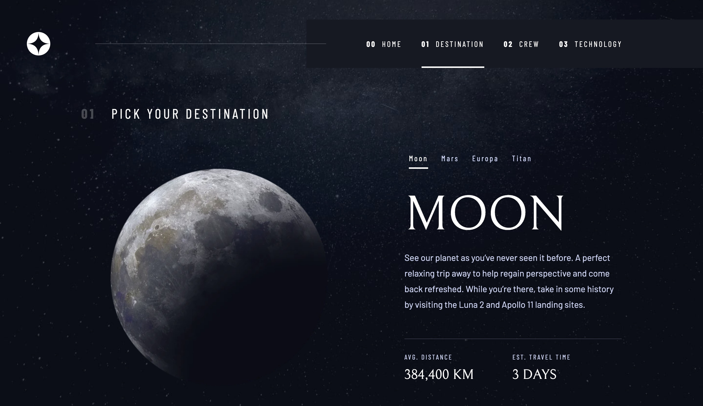

# Frontend Mentor - Space tourism website solution

This is a solution to the [Space tourism website challenge on Frontend Mentor](https://www.frontendmentor.io/challenges/space-tourism-multipage-website-gRWj1URZ3). Frontend Mentor challenges help you improve your coding skills by building realistic projects. 

## Table of contents

- [Overview](#overview)
  - [The challenge](#the-challenge)
  - [Screenshot](#screenshot)
  - [Links](#links)
- [My process](#my-process)
  - [Built with](#built-with)
  - [What I learned](#what-i-learned)
  - [Continued development](#continued-development)
  - [Useful resources](#useful-resources)
- [Author](#author)

## Overview

### The challenge

Users should be able to:

- View the optimal layout for each of the website's pages depending on their device's screen size
- See hover states for all interactive elements on the page
- View each page and be able to toggle between the tabs to see new information

### Screenshot

### Links

- Solution URL: [https://github.com/TheFranMan/fe-space-tourism](https://github.com/TheFranMan/fe-space-tourism)
- Live Site URL: [https://profound-beignet-2bf5f4.netlify.app](https://profound-beignet-2bf5f4.netlify.app)

## My process

### Built with

- Semantic HTML5 markup
- Flexbox
- CSS Grid
- Mobile-first workflow
- [React](https://reactjs.org/) - JS library
- [Cypress](https://www.cypress.io/) - Testing framework
- [React Router](https://reactrouter.com/en/main) - Client side routing

**Note: These are just examples. Delete this note and replace the list above with your own choices**

### What I learned

Used React Router for the first time. Reliased that this is not the best way to apprach this project, a traditional html page approach would have been better. It was a good opportunity to get some expeience with React Router though. Quickly learnt that it is not very a11y friendly, it required a very hacky approach to get screen readers to announce when a new page was loaded.

Used Cypress for end-to-end testing for the first time, was very impressed. There was a bit of a learning curve at the start, but things fell into place quickly.

### Continued development

Going to continue with Cypress for testing. I found it very powerfull and usefull.

### Useful resources

- [Accessible Routing in React](https://timwright.org/blog/2019/03/23/accessible-routing-in-react/) - This helped turn React Router into something accesible.

## Author

- Frontend Mentor - [@TheFranMan](https://www.frontendmentor.io/profile/TheFranMan)